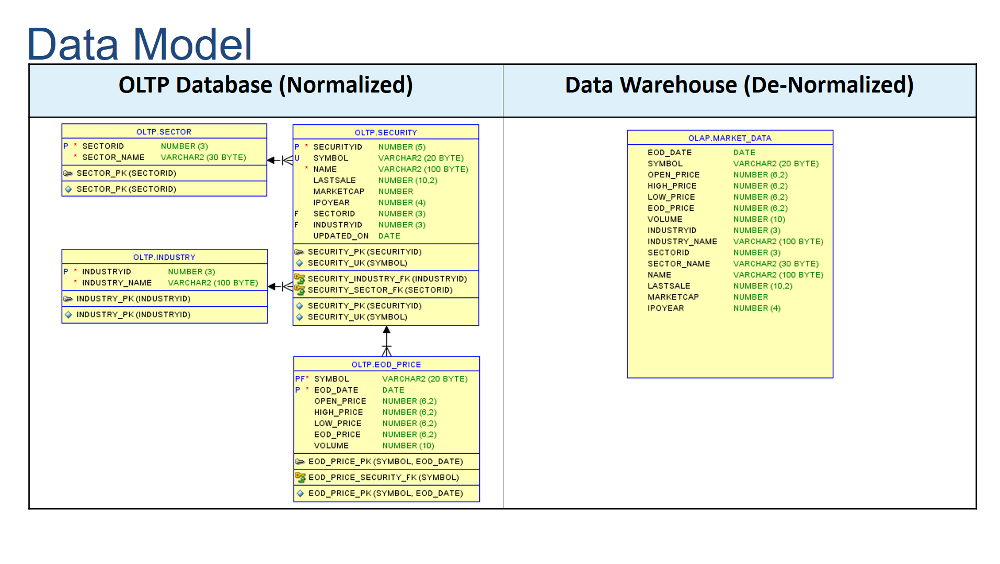

# Migrate ETL pipelines to AWS Redshift

This demo explains a basic example on how we can migrate a legacy Extract-Load-Transform(ELT) processes implemented in Oracle into AWS RedShift using stored procedures or AWS Glue. I have demonstrated below three design implementations to explain this:

1. Legacy Data Warehouse ELT Architecture
2. RedShift ETL with Glue
3. RedShift ELT with Stored Procedure

...

##1. Legacy Data Warehouse ELT Architecture
This shows a basic [ELT architecture](non-aws.png) implemented in Oracle, where some files will be regularly [unloaded](non-aws/daily_unload_from_oracle.sql) by an OLTP database into external files. Those files will then be [loaded](non-aws/legacy_elt.bash) using Oracle SQL Loader tool to a staging schema of the data-warehouse. Once data is loaded, a [stored procedure](non-aws/legacy_elt.proc) will be used to perform all transformations and then it'll load data into target schema in the data-warehouse.

##2. RedShift ETL with Glue
In this design implementation(aws-glue.png), we have similar files [unloaded](aws-glue/daily_unload_from_oracle.sql) by OLTP database into external files. We are then pushing these files to S3 with `aws s3 sync1`. After all files are loaded, a [notification file](aws-glue/notification.txt) will be delivered to S3 bucket. That notification file upload triggers a [lambda function](aws-glue/lambda_handler_glue.py), which fires AWS Glue job(aws-glue/glue-etl-job.py) to transform and load this data into RedShift.

##3. RedShift ELT with Stored Procedure
In this design implementation(aws-redshift-procedure.png), we have similar files [unloaded](redshift-proc/daily_unload_from_oracle.sql) by OLTP database into external files. We are then pushing these files to S3 with `aws s3 sync1`. After all files are loaded, a [notification file](redshift-proc/notification.txt) will be delivered to S3 bucket. That notification file upload triggers a [lambda function](redshift-proc/lambda_handler_redshift.py), which fires `redshift copy` command to push the data into RedShift and also calls a stored procedure](redshift-proc/redshift_elt.proc) to transform and load this data into RedShift. 

---

## Below Diagram explains these three architectures:

