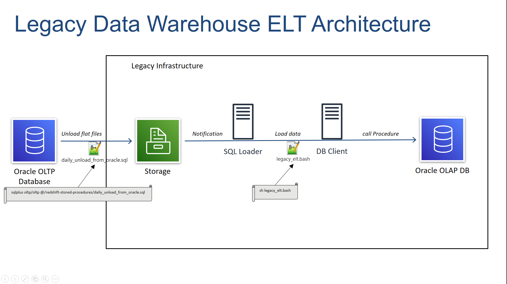

# Migrate ETL pipelines to AWS Redshift

This demo explains a basic example on how we can move our Extract-Load-Transform(ELT) processes implemented in any legacy database like Oracle into AWS RedShift using stored procedures or AWS Glue. I have implemented below three design architectures in this:

* Legacy Data Warehouse ELT Architecture
* RedShift ETL with Glue]
* RedShift ELT with Stored Procedure

